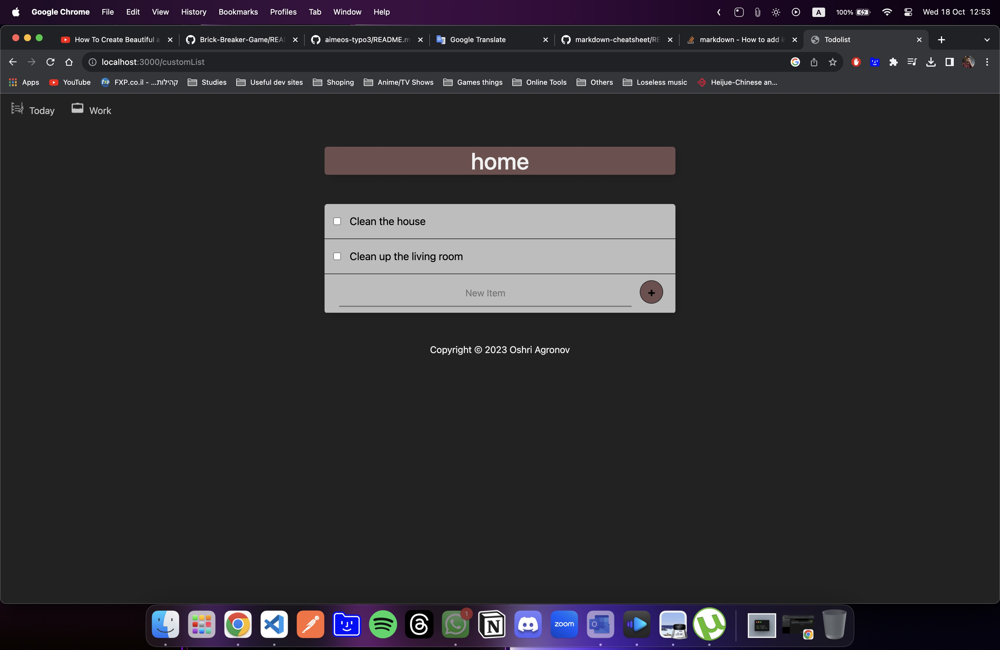

# Todo-list Website
The project is a basically a todo-list on the web where you can add tasks and clear tasks you finished!
You have two built-in lists(Today list, Work list), but you can add a custom list and access them through url structure i will show here

## Table of contents
* [General info](#general-info)
* [Technologies](#technologies)
* [Features](#features)
* [Screenshots](#screenshots)
* [Setup](#setup)
* [Project Status](#project-status)
* [Acknowledgements](#acknowledgements)
* [Contact](#contact)

## General info
The project is as the name suggest, it's a simple todo-list website with couple of features.
I created this project as part of my course in Udemy and it was a good learning experience and fun!
I hope you will enjoy it too and i will be glad to get tips :)


## Technologies
- Software langue: JS, HTML, CSS
- Frameworks: Node.js
- NPM modules dependencies: Express, Mongoose
- Database: MongoDB (NoSQL)

## Features
- The user have to built-in lists from the start(Today, Work)
both of the lists have a buttons on the top left side of the side for quick access.
- The user can create custom lists and access them through url specific structure.
- All lists data saved locally using MongoDB as database, so refresh the page won't lose the data.

## Screenshots




## Setup
To run the todo-list website you need couple of softwares:
- node.js
- npm modules i included(easy to install)

### How to start?
1. First download all project files
2. Open terminal in the project and install all the modules

```bash
npm i
```

3. run the project with node(or nodemon)

```bash
node index.js
```
4. open the browser and enter in the url bar:
```text
localhost:3000
```

## Acknowledgements
I would want to thank to Dr. Angela Yu for creating the great course "The Complete 2023 Web Development Bootcamp"
> Link to the course [here](https://www.udemy.com/course/the-complete-web-development-bootcamp/?kw=The+Complete+2023+Web+Development+Bootcamp&src=sac)