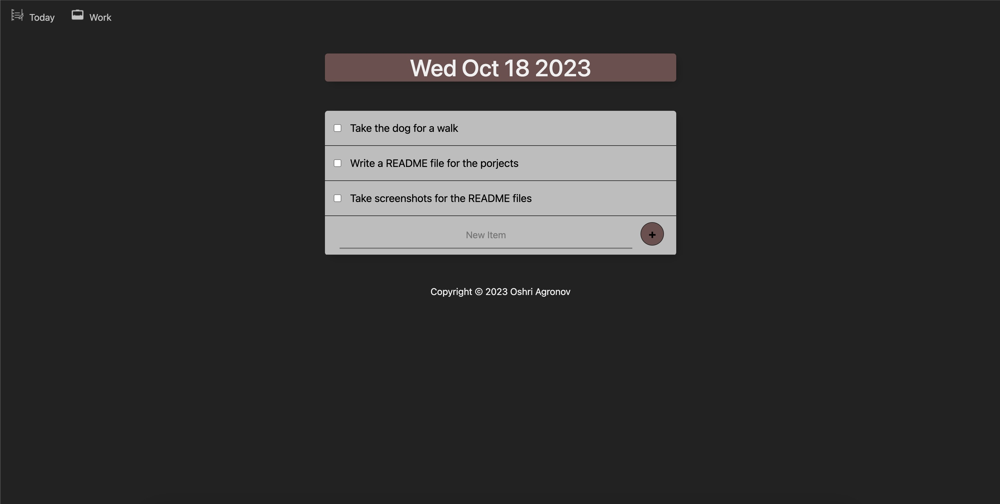
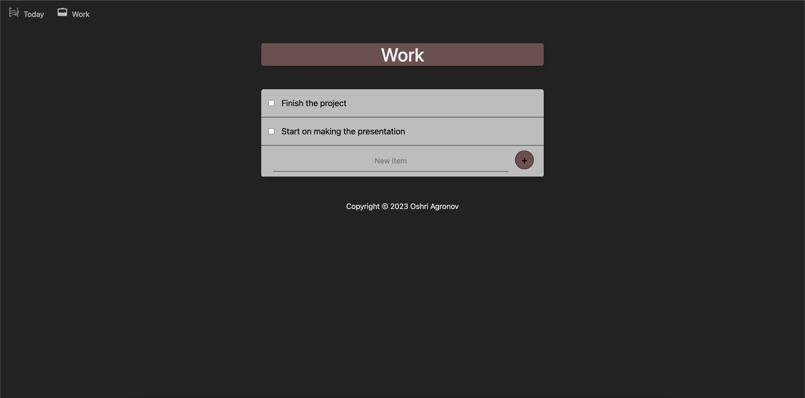

<br />
<div align="center">
  <a href="https://github.com/oshriagronov/todolist-app">
    
  </a>

<h3 align="center">Todo list</h3>
  <p align="center">
    Simple todo-list website.
  </p>
</div>

## About
This project is a simple, minimalistic to-do list application that allows users to create personalized lists easily. 
<br/>Built with Node.js, Express, MongoDB, JavaScript, HTML, and CSS, it saves data locally using a MongoDB database, ensuring that changes are not lost upon refreshing the page.
<br/>The application allows new lists to be created simply by typing the list name into the URL bar.

### Key features
- Create lists with just typing the name in the url bar
- Data saved locally using MongoDB.
- Can mark tasks as done and undo it.

## Technologies used
- js, html&css
- nodejs
- npm modules: express, mongoose, bodyParser
- MongoDB


## Media





## Getting Started

To get a local copy up and running follow these simple steps.

### Prerequisites

- Linux, MacOS or Windows
- nodejs
- npm
- mongoDB

### Installation

---

1. **Clone and enter the Todolist-app repository:**

   ```bash
   git clone https://github.com/oshriagronov/todolist-app && cd todolist
   ```

2. **Install npm modules:**

   ```bash
   sudo npm i
   ```

3. **Run the project with node:**  
   ```bash
   node app.js
   ```

4. Open the browser and enter in the url bar:
```
localhost:3000/<name of the list>
```

- With this structure you access you lists that already exist and if the list doesn't exist it will create one automatically.
- If you don't enter a name it will use the default list called "Home"

## Acknowledgements
I would like to thank to Dr. Angela Yu for creating the great course "The Complete 2023 Web Development Bootcamp"
> Link to the course [here](https://www.udemy.com/course/the-complete-web-development-bootcamp/?kw=The+Complete+2023+Web+Development+Bootcamp&src=sac)
